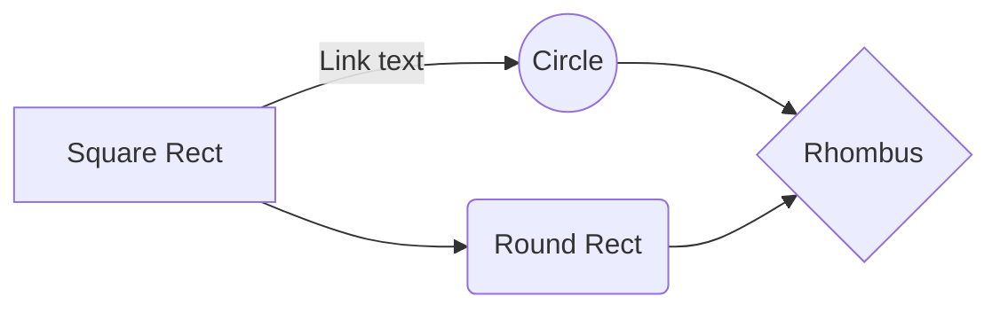

# roots
```sequence
WEBサーバ->DBサーバ: データ挿入
Note right of DBサーバ: DataBaseには\nユーザデータが\n格納される
DBサーバ-->WEBサーバ: データ参照
WEBサーバ->>DBサーバ: データ更新
```

```mermaid
graph LR
A[Square Rect] -- Link text --> B((Circle))
A --> C(Round Rect)
B --> D{Rhombus}
C --> D
```
